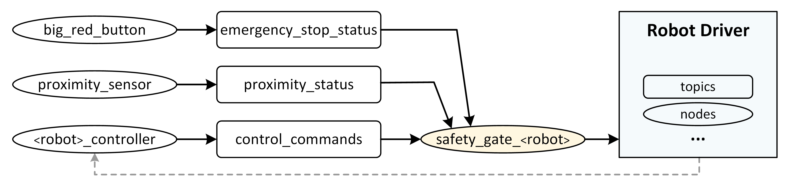

# ProximitySafetyWatchdog

A modular control system that adjusts a robot's speed based on object proximity and responds immediately to an emergency stop signal.


<p style="text-align:center;">Figure 1. Abstracted architecture of the system</p>

The system is based on a safety gate which serves as a pass-through gate for the control signals generated by the robot controller. This gate regulates the actual control signals transmitted to the target platform based on the proximity status and the emergency shutdown button.

The system was developed in ROS 2 and tested using the  (docker.com) image provided in the [pla10/ros2_ur5_interface](https://github.com/pla10/ros2_ur5_interface) repository.

The workspace repository is broken into three packages, [`robot_controllers`](./src/robot_controllers), [`safety_monitor`](./src/safety_monitor), and [`safety_watchdog`](./src/safety_watchdog). The descriptions of each package and the entry points are provided in the README files in the corresponding package directories.


# Prerequisites
- A running docker installation.

# Setup
## 0. If docker was installed fresh
- Make sure it is running
  ```bash
  sudo systemctl status docker
  ```
- If the docker is not already running, run
  ```bash
  sudo systemctl start docker
  ```
- And add your user to the docker group
  ```bash
  sudo usermod -aG docker $USER
  newgrp docker
  ```
## 1. Run the ros2_ur5_interface containers
- Follow instructions on [pla10/ros2_ur5_interface](https://github.com/pla10/ros2_ur5_interface)
- In the `~/ros2_ws/` directory on the noVNC interface of the docker container, run
  ```bash
  source install/setup.bash
  ros2 launch ros2_ur5_interface sim.launch.py
  ```
This should spawn a UR5 robot in Gazebo simulation environment--ready to operate.

- On your local machine, find and note the docker container ID
  ```bash
  docker ps
  ```

## 2. Setting up the repository
- Clone the repository to your local machine and transfer it to the docker container
  ```bash
  docker cp <LOCAL_DIRECTORY>/ProximitySafetyWatchdog <CONTAINER_ID>:/home/ubuntu
  ```
Any of the following steps are done in the noVNC environment, and inside the `~/ProximitySafetyWatchdog` directory.

- Build the repository
  ```bash
  colcon build
  ```
Now the system should be ready to use.

## 3. Usage
### a. Using with UR5
In seperate terminals
- Run [`ur_controller`](./src/robot_controllers/robot_controllers/ur_controller.py) to start generating control signals
  ```bash
  source install/setup.bash
  ros2 run robot_controllers ur_controller
  ```
- Run the emergency button node--the big [`red_button`](./src/safety_monitor/safety_monitor/red_button.py)
  ```bash
  source install/setup.bash
  ros2 run safety_monitor red_button
  ```
- Run the [`proximity_sensor`](./src/safety_monitor/safety_monitor/proximity_sensor.py)
  ```bash
  source install/setup.bash
  ros2 run safety_monitor proximity_sensor
  ````
- Finally, run the [safety_gate](./src/safety_watchdog/safety_watchdog/safety_gate_robot.py) for the UR5 robot
  ```bash
  source install/setup.bash
  ros2 run safety_watchdog safety_gate_robot
  ```

Now the system should be running.

The initial states of the of the robot and the emergency shutdown switch are set [`"EMERGENCY_STOP"`](./src/safety_watchdog/safety_watchdog/config_gate.py#L9) and [`"PRESSED"`](./src/safety_monitor/safety_monitor/config.py#L2), respectively. In order to release the emergeny break and let the robot move, hit the enter key on the terminal running `red_button`.

The robot must now be (1) moving around the workspace, (2) adjusting its speed based on the proximity sensor reading, and (3) stopping abruptly when the enter key is hit on the `red_button` terminal and resuming operation once the enter key is hit a second time.

### A Note
There is a compatility issue between the intended ***velocity*** regulation system and the underlying robot control infrastructure (`ros2_ur5_interface`), which only provides joint ***trajectory*** controllers and does not spawn velocity controllers. 
This mismatch not only overloads the function of the `safety_gate` by requiring it to re-compute slowed down versions of the pre-computed trajectories clipped at arbitrary positions, it also requires the gate to be able to pass acknowledgement and completion status messages back and forth between the `<robot>_controller` and the `Robot Driver`-—a functionality that is not implemented in this example.

A better solution to implementing an integrated, modular, and reusable velocity regulation system would not rely on trajectory tracking status and acknowledgement messages from the `FollowJointTrajectory` action interface.
Instead, the `<robot>_controller` should get the necessary feedback directly from the robot state publishers (Figure 1 dashed line), and generate the velocity control signals to drive the robot in closed-loop and in (near-)real-time based on the current robot state.
This would,
1. Greatly reduce the functionality overload on the `safety_gate` and it would now finally be only responsible for adjusting operation velocities.
2. Get rid of additional delays and unnecessary complexities caused by passing identical messages back and forth between the `<robot>_controller` and the `Robot Driver`.
3. Improve the reliability and reusability of the `safety_gate`.

Although augmenting the underlying robot simulation infrastructure with velocity controllers is beyond the scope of this work, an example of how such control scheme can work is provided using `turtlesim`--a native ROS species.
The `safety_gate` for this scheme is provided in [`safety_gate_turtle.py`](./src/safety_watchdog/safety_watchdog/safety_gate_turtle.py). Notice how much simpler--and maintainable--this gate is. The section below provides the steps to run an example where the `ProximitySafetyWatchdog` system is used to regulate the velocity of a turtle bot moving on a circular path.

### b. Using with turtlesim
- Stop any running module and the Gazebo simulation
- Run turtlesim
  ```bash
  ros2 run turtlesim turtlesim_node
  ```

In seperate terminals run the following. You might have to `source install/setup.bash` if you are using new terminal windows.
- Run [`turtle_controller`](./src/robot_controllers/robot_controllers/turtle_controller.py) to start generating control signals
  ```bash
  ros2 run robot_controllers turtle_controller
  ```
- Run the emergency button node--the big [`red_button`](./src/safety_monitor/safety_monitor/red_button.py)
  ```bash
  ros2 run safety_monitor red_button
  ```
- Run the [`proximity_sensor`](./src/safety_monitor/safety_monitor/proximity_sensor.py)
  ```bash
  ros2 run safety_monitor proximity_sensor
  ````
- Finally, run the [safety_gate_turtle](./src/safety_watchdog/safety_watchdog/safety_gate_turtle.py) for the UR5 robot
  ```bash
  ros2 run safety_watchdog safety_gate_turtle
  ```
- Release the emergency stop button by hitting enter on the `red_button` terminal.

Similar to the UR example, the turtle must now be (1) moving around the workspace, (2) adjusting its speed based on the proximity sensor reading, and (3) stopping abruptly when the enter key is hit on the `red_button` terminal and resuming operation once the enter key is hit a second time.

## 4. References & Sources
- https://github.com/pla10/ros2_ur5_interface
- https://docs.universal-robots.com/Universal_Robots_ROS2_Documentation/
- https://docs.docker.com/engine/install/ubuntu/

## 5. Statement of AI use
- I **did** use Copilot plugin as a code completion tool in VS Code.
- I **did not** use any AI tool to generate chunks of code or files.
- I **did not** use any AI tool during the ideation of the approach or the architecture.

## 6. Future work
- Fork `ros2_ur5_interface` and add `ur_controller` velocity control to the launch files. Refactor and unify the `safety_gate_robot`.
- Can make `config.py` parameters available system-wide. Not sure if that is a good idea though since \(almost\) all `config.py` parameters are actually private.
- can spawn multiple threads to handle several safety_gate callbacks in parallel (e.g. MultiThreadedExecutor). though it doesn't take much time for a callback to return so i'm not sure if that's absolutely necessary.
- can check if the robot stopped after the stop message is sent, and keep sending the stop message after you make sure the robot stops.
- almost like a bug but actually is a feature: if the red_button is ran and it is released, since safety_gate starts with `robotOpStatus.mode="EMERGENCY_STOP"` as default, you need to press/release the red button to start operation. 
- can publish robotOpStatus on a topic to make it available for other modules to monitor. this topic should be protected and limited to authorized nodes only
- make emergency_stop_status and proximity sensor topics only available to write to their associated nodes. alternatively use namespaces for packages.
- can put volatile stuff, like hysteresis width, passable by arguments.

